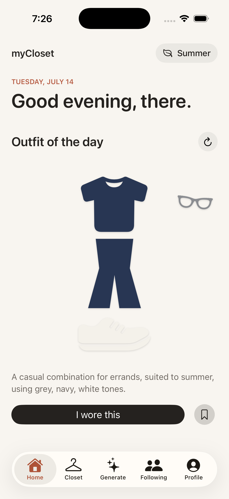
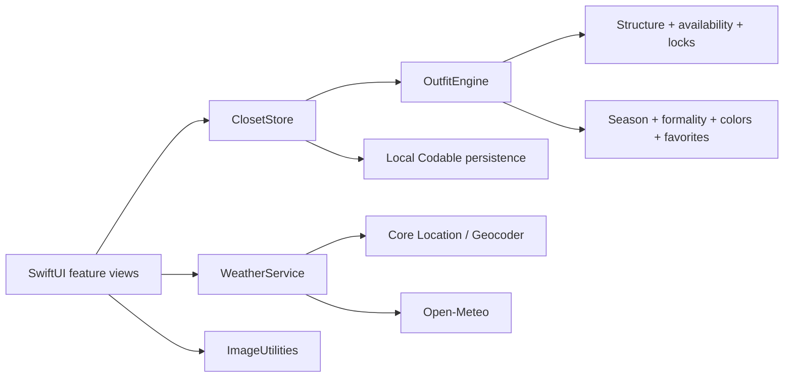

# myCloset

[](https://github.com/mkodithuwakku/myCloset/actions/workflows/ios.yml)


myCloset is a native SwiftUI iPhone application that turns a private wardrobe into practical outfit recommendations. Users can add clothing, confirm detected colors and metadata, generate outfits for an occasion and formality level, lock pieces they want to wear, reroll the remaining pieces, and retain saved or worn outfit history.

> **Project status:** Phase 0 local functional prototype is complete. The app is usable without a backend, but it is not an App Store release candidate. Authentication, cloud sync, real social posting, moderation, trip packing, and production operations are intentionally deferred to documented phases.



## Why this project exists

Choosing an outfit is a constraint problem: the pieces must belong to the user, be available, fit the weather and season, meet the occasion's formality, work together structurally, and feel visually coherent. myCloset makes those constraints explicit while keeping the experience warm, quick, and understandable.

The long-term product is designed around three principles:

1. **Private by default.** A closet is never exposed merely because a user posts an outfit.
2. **Explainable recommendations.** Hard rules remain deterministic; ranking and future AI assistance cannot bypass ownership, privacy, or outfit validity.
3. **Honest product boundaries.** Prototype-only and unavailable capabilities are labelled rather than simulated with fake network behavior.

## Current capabilities

| Area | Working in Phase 0 |
|---|---|
| Home | Minimal Outfit of the Day canvas that composes garment images into one look, with compact weather context and secondary actions |
| Closet | Local creation, editing, search, category filtering, favorites, availability, archive, and deletion |
| Item intelligence | Photo import, resizing, sampled dominant/accent color suggestions, manual color confirmation, season and multi-formality metadata |
| Generator | Occasion presets, six formality levels, locked pieces, complete outfit generation, one-piece reroll, unlocked reroll, and explanations |
| Weather | Optional approximate current location, manual city lookup, Open-Meteo conditions, or date-derived season fallback |
| History | Separate saved and worn outfit collections using immutable snapshots |
| Profile | Local display name, handle, biography, and profile image editing |
| Following | A deliberate preview explaining the safety/backend requirements; no fake social service |
| Persistence | Local JSON application-support storage that survives relaunches |
| Tests | 30 unit tests and 3 end-to-end UI smoke tests |

The authoritative implementation boundary is maintained in [Prototype Status](PROTOTYPE_STATUS.md).

## Quick start

### Requirements

- macOS with Xcode 26 or later recommended
- An iPhone simulator running iOS 17 or later
- No API keys, package manager, or backend

### Run the app

1. Clone the repository.
2. Open `myCloset.xcodeproj`.
3. Select the shared `myCloset` scheme and an iPhone simulator.
4. Press **Run**.
5. Choose **Load sample closet** for an immediate usable wardrobe, or add your own pieces from the Closet tab.
6. Open Generate, select an occasion and formality, optionally lock a piece, and create an outfit.

Command-line build:

```sh
xcodebuild \
  -project myCloset.xcodeproj \
  -scheme myCloset \
  -sdk iphonesimulator \
  -destination 'generic/platform=iOS Simulator' \
  -derivedDataPath /tmp/myClosetDerivedData \
  CODE_SIGNING_ALLOWED=NO \
  build
```

### Run the tests

Choose an available simulator and run:

```sh
xcodebuild \
  -project myCloset.xcodeproj \
  -scheme myCloset \
  -destination 'platform=iOS Simulator,name=iPhone 17 Pro,OS=latest' \
  -derivedDataPath /tmp/myClosetTestDerivedData \
  test
```

See [Testing](docs/TESTING.md) for unit-only, UI-only, CI, coverage, troubleshooting, and test-quality guidance.

## Architecture at a glance



The current build is deliberately local-first. Production service boundaries, data ownership rules, social snapshot isolation, and the migration path are documented in [Architecture](docs/ARCHITECTURE.md).

## Repository structure

```text
.
├── myCloset/                     SwiftUI application and domain logic
├── myClosetTests/                Deterministic model, engine, store, and image tests
├── myClosetUITests/              End-to-end iPhone UI smoke tests
├── myCloset.xcodeproj/           Shared Xcode project and scheme
├── docs/
│   ├── phases/                   One implementation contract per roadmap phase
│   ├── decisions/                Architecture decision records
│   ├── ARCHITECTURE.md
│   ├── DEVELOPMENT.md
│   ├── ROADMAP.md
│   ├── TESTING.md
│   └── REQUIREMENTS_TRACEABILITY.md
├── .github/                      CI, issue forms, and pull-request template
├── SRS.md                        Enterprise product requirements baseline
├── PROTOTYPE_STATUS.md           Current implementation boundary
└── CHANGELOG.md                  User- and maintainer-visible changes
```

## Roadmap

| Phase | Outcome | Status |
|---:|---|---|
| 0 | Local functional prototype and engineering foundation | **Complete** |
| 1 | Production-quality garment capture and wardrobe data | Next |
| 2 | Identity, secure backend, sync, and private media | Planned |
| 3 | Recommendation quality, feedback, weather resilience, and explainability | Planned |
| 4 | Social profiles, following, posting, reporting, blocking, and moderation | Planned |
| 5 | Trip outfits, packing, availability conflicts, and offline synchronization | Planned |
| 6 | TestFlight, privacy/security hardening, operations, and App Store release | Planned |
| 7 | Scale, localization, advanced personalization, and measured evolution | Future |

Read the [Master Roadmap](docs/ROADMAP.md) and the linked phase documents for entry criteria, workstreams, test obligations, exit gates, risks, and deliverables.

## Documentation

| Document | Purpose |
|---|---|
| [Software Requirements Specification](SRS.md) | Full product, data, security, privacy, reliability, and release requirements |
| [Documentation Index](docs/README.md) | Ownership and navigation for all project documents |
| [Codex Repository Context](AGENTS.md) | Durable product, architecture, testing, and handoff context for coding agents |
| [Architecture](docs/ARCHITECTURE.md) | Current design, production target, boundaries, and data flow |
| [Roadmap](docs/ROADMAP.md) | Sequenced delivery phases and release gates |
| [Testing](docs/TESTING.md) | Automated/manual strategy, commands, matrices, and quality gates |
| [Latest Test Execution](docs/testing/TEST_EXECUTION_2026-07-14.md) | Environment, commands, results, fixes, and remaining qualification work |
| [Development Guide](docs/DEVELOPMENT.md) | Setup, workflow, conventions, and debugging |
| [Requirements Traceability](docs/REQUIREMENTS_TRACEABILITY.md) | SRS-to-phase-to-test mapping |
| [Contributing](CONTRIBUTING.md) | Branch, change, review, and documentation rules |
| [Security Policy](SECURITY.md) | Private vulnerability reporting and supported state |
| [Changelog](CHANGELOG.md) | Versioned project changes |

## Documentation maintenance policy

The README is a living project entry point. Every pull request that changes behavior, scope, setup, testing, architecture, or phase status must update the relevant documentation in the same change.

At minimum:

- user-visible behavior changes update **Current capabilities** and `CHANGELOG.md`;
- phase progress updates `docs/ROADMAP.md`, the phase document, and `PROTOTYPE_STATUS.md`;
- architecture changes add or update an ADR and `docs/ARCHITECTURE.md`;
- test changes update `docs/TESTING.md` and the suite counts above;
- setup changes update **Quick start** and `docs/DEVELOPMENT.md`.

CI verifies that required documents and phase files remain present. Reviewers enforce correctness, because documentation presence alone does not guarantee accuracy.

## Contributing

Start with [CONTRIBUTING.md](CONTRIBUTING.md). Small, reviewable branches with tests and documentation are preferred. Do not add real social publishing, cloud media, or authentication without the privacy, authorization, deletion, reporting, and moderation work defined in the applicable phase.

## Privacy and safety

The current prototype stores wardrobe and profile content locally in the app container. Location is optional and used only for an explicit weather request. The app removes the need for weather access by supporting a date-derived season fallback.

The production requirements are stricter: private closets, detached public outfit snapshots, server-side authorization, token revocation, account deletion, reporting, blocking, moderation, audited operator access, and no generalized model training on private content without separate consent. See the [SRS](SRS.md) and [Security Policy](SECURITY.md).

## License

No open-source license has been selected yet. Until a license file is added, the source is publicly viewable but no permission is granted to copy, modify, or redistribute it. A project owner should make an explicit licensing decision before inviting broad external contributions.
