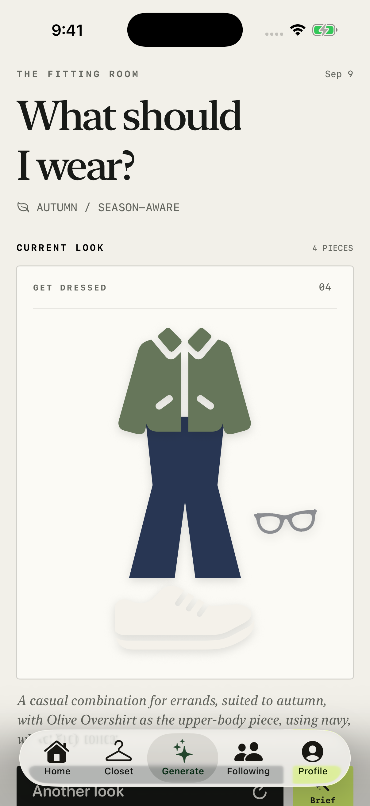
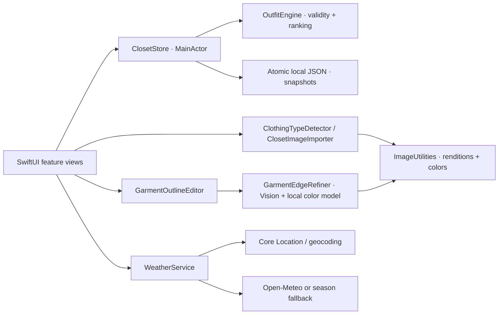

# myCloset

**A native iPhone wardrobe app with on-device garment isolation and outfit recommendations.**

[](https://github.com/mkodithuwakku/myCloset/actions/workflows/ios.yml)


myCloset turns photos of clothes into a private, searchable wardrobe and outfits built from pieces the user actually owns. Import a garment, refine its cutout, confirm its details, and generate a look for an occasion. Lock a favorite piece, swap the rest, and save what worked.

The project brings together **SwiftUI interaction design, image processing, constrained recommendation logic, local persistence, and automated testing**. Clothing photos and outfit intelligence stay on-device; the core experience requires no account, backend, API key, or third-party package.

> **Status:** Phase 0 local functional prototype is complete; Phase 1 capture and wardrobe quality work is in progress. Version `0.1.0` runs locally. The next milestone is qualifying this version for TestFlight and the App Store; it has not been released on the App Store. Edge refinement is experimental, and physical-device qualification remains open.

[Features](#features) · [Engineering highlights](#engineering-highlights) · [Architecture](#architecture) · [Run locally](#run-locally) · [Tests](#tests-and-verification) · [Release roadmap](#release-roadmap)

## App preview

<table>
  <tr><th>Outfit of the Day</th><th>Generate and refine a look</th></tr>
  <tr>
    <td></td>
    <td></td>
  </tr>
</table>

Screenshots show the current Simulator build using the built-in development sample closet. Real users start with an empty closet and import their own photos. Personal test photos are excluded from Git.

## Features

| Area | Implemented behavior |
|---|---|
| **Capture and import** | Photos and Files batches of up to 50 images, visible progress, per-photo skip/recovery, required outlining, guided metadata review, and import summaries |
| **Garment cutouts** | Closed finger-drawn outlines, multiple regions, rotate/reset/retrace, transparent PNG output, and experimental automatic edge refinement with a **Refined / My outline** comparison |
| **Editable suggestions** | Filename and on-device visual type suggestions, garment-only dominant/accent colors, separate confidence guidance, and automatic names that preserve manual edits |
| **Clothing taxonomy** | 29 specific types—including Shorts, Long Sleeve, Jacket, Jeans, and Hoodie—with matching editable season/formality defaults; multiple seasons and formality levels per item |
| **Closet management** | Create, edit, search, filter by type, favorite, archive, mark availability, show duplicate-name warnings, and delete from the long-press menu with confirmation |
| **Outfit generation** | Daily looks, occasion briefs, six formality levels, explanations, piece locks, individual swaps, and full rerolls with closet-readiness recovery |
| **Outfit presentation** | A shared image composition for Home and Generate, proportionate footwear, smaller tops/jackets, and limited waistband overlap; a jacket replaces the shirt in separates |
| **Weather fallback** | Optional approximate location → manual city → date-derived season; live conditions use Open-Meteo through the weather service |
| **History and profile** | Separate saved/worn outfit snapshots and an editable local profile; later closet edits and deletions preserve historical outfits |
| **Offline core** | Closet, profile, history, and generation persist locally and work without live weather. Following is a clearly labeled **Coming Soon** screen |

The [implementation status](PROTOTYPE_STATUS.md) distinguishes delivered features, prototype limitations, and deferred scope.

## Engineering highlights

### An imprecise outline becomes a reviewable cutout

A finger trace communicates which item the user wants. The image pipeline uses that outline to select relevant Vision foreground instances and look for nearby fabric edges. When Vision is unavailable or unsuitable, a local color model compares the garment interior with surrounding background in a narrow band around the outline. It can remove background included by the trace and recover small areas of fabric outside it.

The implementation checks each outlined region, rejects candidates that lose too much garment interior or expand into distant background, and removes disconnected specks. This matters for asymmetric hems and separate shoes: a plausible overall mask must not hide the loss of one region. Source images are normalized to at most 1,200 pixels; color refinement analyzes a bounded 600-pixel grid. Work runs off the main actor, and cancellation plus request IDs prevent stale results from replacing a new trace.

Users compare **Refined** with **My outline** before applying a result. Manual recovery remains available. Similar colors, rugs, shadows, fine trim, and large tracing errors can still require correction. The implementation uses Apple Vision and local heuristics; no custom model training or cloud inference is claimed.

**Code:** [GarmentEdgeRefiner](myCloset/GarmentEdgeRefiner.swift), [outline editor](myCloset/GarmentOutlineEditor.swift), [image utilities](myCloset/ImageUtilities.swift), [regression tests](myClosetTests/GarmentEdgeRefinerTests.swift).

### Recommendation variety within explicit rules

The outfit engine separates hard validity checks from soft preferences. Availability, exclusions, outfit structure, and locked-piece conflicts are handled before selection. Season and formality guide candidate pools; color compatibility, favorites, and randomized ranking provide variety among eligible pieces. A sparse closet falls back to available owned items with an explanation.

Separates contain a top **or** outerwear plus a bottom. Jackets replace shirts, and rerolls preserve the other valid pieces. Repeated randomized tests check invariants rather than asserting one exact outfit.

**Code:** [OutfitEngine](myCloset/OutfitEngine.swift), [engine tests](myClosetTests/OutfitEngineTests.swift), [constraint decision](docs/decisions/0002-hybrid-recommendation-engine.md), [garment and jacket rules](docs/decisions/0005-garment-types-and-jacket-composition.md).

### Local data with stable history

An observable `@MainActor` store coordinates app state and atomic Codable JSON writes in Application Support. Saved and worn looks copy garment details into immutable snapshots, so editing or deleting a closet item does not rewrite history. Optional garment subtypes retain compatibility with older generic records. Tests inject a temporary storage URL and verify reloads and snapshot behavior.

**Code:** [ClosetStore](myCloset/ClosetStore.swift), [domain models](myCloset/Models.swift), [store tests](myClosetTests/ClosetStoreTests.swift).

### Recovery is part of the interaction

Image imports expose progress, uncertainty, explicit confirmation, and per-photo skipping. Type or color changes update suggested names while retaining custom names. Weather can fall back to a city or season. An incomplete closet explains what is missing and routes the user to corrections. Native controls, text labels, and accessibility identifiers support interaction and UI testing; a full accessibility audit remains a release gate.

The development workflow also addresses a reproduced Simulator launch failure: the shared Run action waits for the selected Simulator and refreshes the signed installation without erasing closet data. Automated tests run on their own disposable Simulator.

## Architecture

| Layer | Technologies and responsibility |
|---|---|
| Presentation | SwiftUI, native navigation/forms, reusable garment composition and controls |
| Image pipeline | Vision, UIKit, Core Graphics, Core Image, and Swift concurrency for normalization, masks, refinement, and palette suggestions |
| Domain | Swift value types, explicit garment/outfit rules, soft scoring, and snapshots |
| Persistence | Foundation/Codable, atomic local JSON, injected storage for tests |
| Weather | Core Location, geocoding, URLSession/Open-Meteo, and season fallback |
| Verification | XCTest/XCUITest, Python host checks, shared Xcode scheme/test plan, and GitHub Actions |



The current store combines state, persistence, and orchestration. That is deliberate prototype debt: schema versioning, file-backed image storage, and clearer repository boundaries remain planned. The weather service also needs stronger provider isolation and resilience tests. These tradeoffs and the approved local release boundary are documented in [Architecture](docs/ARCHITECTURE.md) and [ADR-0003](docs/decisions/0003-zero-backend-app-store-release.md).

## Run locally

**Requirements:** macOS, Xcode 26.x recommended, and an installed iPhone Simulator runtime. The project uses Swift 5 language mode and targets iOS 17.0 or later. Verification has used Xcode 26.3 and iOS 26.3.1 Simulator; the full supported-device matrix is not yet qualified.

```sh
git clone https://github.com/mkodithuwakku/myCloset.git
cd myCloset
open myCloset.xcodeproj
```

1. Select the shared **myCloset** scheme and an iPhone Simulator, then press **Run**.
2. Open **Closet → Import** and choose your photos, or use **Closet → + → Import image files**.
3. Trace near the garment edge, compare the proposed refinement, and apply the preferred cutout. For shoes, outline one shoe, choose **Add another area**, then outline the other, leaving the gap outside both outlines.
4. Confirm name, type, colors, seasons, and formality. Suggestions remain editable; accidental photos can be skipped.
5. Open **Generate**, choose a brief if desired, and lock or reroll pieces. Save a look or mark it worn to retain a snapshot.

A top or jacket plus a bottom—or a one-piece—provides the base for a look; footwear is added when available. For a reproducible demo without importing photos, add `-loadPrototypeSamples` to the shared scheme's Run arguments in a separate development Simulator. This Debug-only fixture contains 12 sample pieces; it is not real-user onboarding.

<details>
<summary>Load local test images and retry analysis</summary>

Put your own JPEG, PNG, HEIC, HEIF, or WebP files in the Git-ignored `TestClosetImages/` directory, boot the intended Simulator, then run:

```sh
./scripts/load_test_closet_images.sh
```

The loader converts WebP for Simulator Photos and checks content hashes to avoid duplicate imports. For predictable filename suggestions, import descriptively named files such as `navy-shirt.jpg` or `black-jeans.png` through Files.

Use **Closet → + → Re-analyze photo details** for a batch, or open one item's editor and choose **Re-analyze this photo**. A new outline can replace an older cutout. Custom metadata remains editable throughout review.

</details>

Build, signing, launch-recovery, and debugging commands are in the [Development Guide](docs/DEVELOPMENT.md).

## Tests and verification

**Inventory: 91 unit tests and 10 UI journey tests, plus 8 host-side launch-workflow checks.**

| Coverage | Examples |
|---|---|
| Recommendation invariants | Repeated generation, availability/exclusions, locked pieces, jacket/top conflicts, and single/full replacements |
| Persistence and history | Atomic save/reload, legacy subtype compatibility, deletion, and immutable saved/worn snapshots |
| Image processing | Invalid/large input, transparent masks, orientation, asymmetric hems, separate shoes, color suggestions, refinement fallback, and cancellation |
| UI journeys | Import/outline/review, correction and skip recovery, refinement comparison, closet editing/deletion, and generation |
| Host tooling | Signed installation preparation, destination isolation, error propagation, and safe Simulator selection |

Run from the repository root:

```sh
./scripts/test_ios.py
python3 -m unittest discover -s scripts/tests -v
./scripts/verify_docs.sh
```

The app test runner creates and removes its own temporary Simulator, keeping reset fixtures away from the interactive closet, and retains its result bundle. Add `-only-testing:myClosetTests` or `-only-testing:myClosetUITests` for narrower runs.

**Latest evidence:** the refinement change passed all 91 unit tests and two targeted UI journeys, with additional successful comparison-layout reruns and visual inspection. The complete 10-test UI suite and physical-device matrix were not rerun for that slice. See the [dated execution report](docs/testing/TEST_EXECUTION_2026-09-09.md) for commands, results, initial failures, and remaining qualification. Inventory is not a claim that every test ran in the latest session.

[GitHub Actions](.github/workflows/ios.yml) is configured to build and run the full app test plan, check documentation, and run the host checks on pushes and pull requests to `main`. Detailed strategy and coverage mappings are in [Testing](docs/TESTING.md) and [Requirements Traceability](docs/REQUIREMENTS_TRACEABILITY.md).

## Release roadmap

The next planned milestone is preparing the current local app for **TestFlight and an App Store release**. Release scope and acceptance criteria will be confirmed against the existing requirements before submission.

| Milestone | Work remaining |
|---|---|
| Capture and data quality | Qualify refinement on physical devices; improve difficult-photo recovery; validate photo metadata removal and image lifecycle; add persistence versioning/recovery |
| Release qualification | Confirm included P0 requirements, run the full device/OS and accessibility matrix, test clean-install/permission/offline flows, and gather performance and reliability evidence |
| Store preparation | Finalize identity/icon, signing and bundle configuration, support/privacy materials, store screenshots and disclosures, and TestFlight feedback |
| Later local features | Guided camera capture, point/undo editing, richer recommendation feedback, and trip/packing workflows remain tracked scope; inclusion depends on the release decision |
| Post-release social | CloudKit profiles, following, and controlled outfit posts are gated future work; Following currently has no social service |

The [Roadmap](docs/ROADMAP.md), [Phase 1 contract](docs/phases/PHASE_1_CAPTURE_WARDROBE.md), and [release gates](docs/phases/PHASE_6_BETA_RELEASE.md) contain the full plan. Future social must follow [ADR-0004](docs/decisions/0004-post-release-cloudkit-social.md). The first release remains account-free, with local wardrobe data and no cloud AI or developer-operated media backend.

## Repository guide

| Path | Purpose |
|---|---|
| [`myCloset/`](myCloset/) | Application, views, domain logic, and services |
| [`myClosetTests/`](myClosetTests/) / [`myClosetUITests/`](myClosetUITests/) | Unit, integration, image, and UI tests |
| [`scripts/`](scripts/) | Isolated testing, Simulator launch preparation, image loading, and documentation checks |
| [`myCloset.xcodeproj/`](myCloset.xcodeproj/) / [`myCloset.xctestplan`](myCloset.xctestplan) | Shared project, scheme, and test configuration |
| [`docs/`](docs/README.md) | Architecture, decisions, phase contracts, development guides, and test evidence |
| [`SRS.md`](SRS.md) / [`PROTOTYPE_STATUS.md`](PROTOTYPE_STATUS.md) | Product requirements and the current implementation boundary |
| [`CHANGELOG.md`](CHANGELOG.md) / [`AGENTS.md`](AGENTS.md) | Change history and durable repository context |

## Privacy, contributions, and licensing

Private wardrobe/profile media and saved history stay in the app container. Live weather is optional and makes a provider request; core wardrobe and outfit functions do not require that request. The current app has no account, cloud recovery, public posting, or cross-device sync.

See [Contributing](CONTRIBUTING.md) for the change workflow and [Security Policy](SECURITY.md) for vulnerability reporting. Behavior, architecture, test, or setup changes include corresponding documentation updates. No open-source license has been selected; the repository currently contains no license grant.
