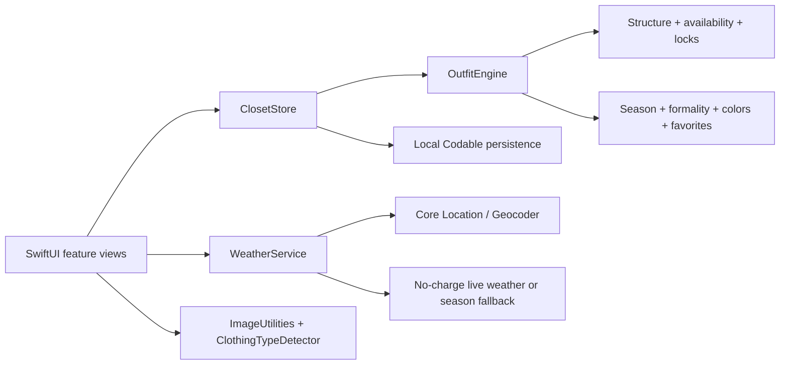

# myCloset

[](https://github.com/mkodithuwakku/myCloset/actions/workflows/ios.yml)


myCloset is a native SwiftUI iPhone application that turns a private wardrobe into practical outfit recommendations. Users can add clothing, confirm detected colors and metadata, generate outfits for an occasion and formality level, lock pieces they want to wear, reroll the remaining pieces, and retain saved or worn outfit history.

> **Project status:** Phase 0 local functional prototype is complete. The approved first App Store release remains account-free and local-only; Following is a truthful Coming Soon screen. If released users show interest, Phase 7 adds CloudKit profiles and following without uploading private closets or introducing a separate hosting subscription.


## Why this project exists

Choosing an outfit is a constraint problem: the pieces must belong to the user, be available, work together structurally, and feel coherent for the weather, season, and occasion. myCloset makes those constraints explicit while keeping the experience quick and understandable.

The long-term product is designed around three principles:

1. **Private by default.** Closet, history, trips, preferences, and original garment images stay in the app container; later public social data is explicit and detached.
2. **Explainable recommendations.** Hard rules remain deterministic; ranking and future AI assistance cannot bypass ownership, privacy, or outfit validity.
3. **Zero-operated-backend core.** Core functionality runs on-device; optional post-release social uses CloudKit within Apple Developer Program membership.

## Current capabilities

| Area | Working in Phase 0 |
|---|---|
| Home | Minimal Outfit of the Day canvas that composes garment images into one look, with compact weather context and secondary actions |
| Closet | Local creation, bulk image import, full metadata editing, metadata-aware search, category filtering, favorites, availability, archive, and deletion |
| Item intelligence | Filename-first suggestions plus on-device foreground-shape analysis, jacket/hoodie outerwear recognition, garment-focused perceptual color sampling, metadata-synchronized default names, and mandatory per-piece confirmation before a batch is saved |
| Generator | Photo-first editorial outfit board, automatic first look, visual occasion/formality brief, locked pieces, single-piece reroll, reliably different alternatives when the closet permits, and visible actionable feedback after every generation attempt |
| Weather | Optional approximate current location, manual city lookup, Open-Meteo conditions, or date-derived season fallback |
| History | Separate saved and worn outfit collections using immutable snapshots |
| Profile | Local display name, handle, biography, and profile image editing |
| Following | Minimal Coming Soon state for the gated post-release CloudKit social phase; no fake profiles or posts |
| Persistence | Local JSON application-support storage that survives relaunches |
| Tests | 56 unit tests and 5 end-to-end UI smoke tests |

The authoritative implementation boundary is maintained in [Prototype Status](PROTOTYPE_STATUS.md).

## Quick start

### Requirements

- macOS with Xcode 26 or later recommended
- An iPhone simulator running iOS 17 or later
- No API keys, package manager, or backend

### Run the app

1. Clone the repository.
2. Open `myCloset.xcodeproj`.
3. Select the shared `myCloset` scheme and an iPhone simulator.
4. Press **Run**.
5. Open **Closet → Import** and choose your own clothing images. The app intentionally starts empty—there is no demo wardrobe mixed into your items.
6. Open Generate to see an automatic unlocked look. Open **Brief** only when you want to change the scene or dressed-up level, then choose **Another look** for a different valid combination when your closet has alternatives. You can lock a piece after it appears if you want it to stay during rerolls.

### Seed a test closet from laptop images

1. Put up to 50 garment images in the repository's `TestClosetImages/` directory and boot the iPhone Simulator. These local images are ignored by Git. The loader transparently converts WebP files to temporary JPEG copies because Simulator Photos does not accept WebP directly.
2. From the repository root, load the folder into the simulator's Photos library. The loader tracks image content per Simulator and safely skips files it has already loaded, including same-content duplicates in the folder:

```sh
./scripts/load_test_closet_images.sh
```

3. In the app, open **Closet**, tap **Import**, and multi-select the images. The app proposes on-device name, type, dominant/accent color, season, and formality values, then shows every photo in a required review queue. Changing the suggested type or main color updates the default name automatically; typing a custom name keeps that name fixed. Correct any field and confirm each piece; nothing is added to the closet until the batch is confirmed. To repair pieces imported by an older build, choose **Closet → + → Re-analyze photo details** and confirm the reviewed batch.

For deterministic type detection, use descriptive names such as `navy-shirt.jpg`, `black-jeans.png`, `white-sneakers.jpeg`, `camel-coat.jpg`, and `silver-watch.png`, make those files available in the simulator's Files app (for example through iCloud Drive), then choose **Closet → + → Import image files**. Filename rules take priority over image classification.

Command-line build:

```sh
xcodebuild \
  -project myCloset.xcodeproj \
  -scheme myCloset \
  -sdk iphonesimulator \
  -destination 'generic/platform=iOS Simulator' \
  -derivedDataPath /tmp/myClosetDerivedData \
  CODE_SIGNING_ALLOWED=NO \
  build
```

### Run the tests

Choose an available simulator and run:

```sh
xcodebuild \
  -project myCloset.xcodeproj \
  -scheme myCloset \
  -destination 'platform=iOS Simulator,name=iPhone 17 Pro,OS=latest' \
  -derivedDataPath /tmp/myClosetTestDerivedData \
  test
```

See [Testing](docs/TESTING.md) for unit-only, UI-only, CI, coverage, troubleshooting, and test-quality guidance.

## Architecture at a glance



The current build and first release are deliberately local-only. Persistence evolution and the launch boundary are documented in [Architecture](docs/ARCHITECTURE.md) and [ADR-0003](docs/decisions/0003-zero-backend-app-store-release.md); [ADR-0004](docs/decisions/0004-post-release-cloudkit-social.md) governs the later CloudKit social addition.

## Repository structure

```text
.
├── myCloset/                     SwiftUI application and domain logic
├── myClosetTests/                Deterministic model, engine, store, and image tests
├── myClosetUITests/              End-to-end iPhone UI smoke tests
├── myCloset.xcodeproj/           Shared Xcode project and scheme
├── docs/
│   ├── phases/                   One implementation contract per roadmap phase
│   ├── decisions/                Architecture decision records
│   ├── ARCHITECTURE.md
│   ├── DEVELOPMENT.md
│   ├── ROADMAP.md
│   ├── TESTING.md
│   └── REQUIREMENTS_TRACEABILITY.md
├── .github/                      CI, issue forms, and pull-request template
├── SRS.md                        Enterprise product requirements baseline
├── PROTOTYPE_STATUS.md           Current implementation boundary
└── CHANGELOG.md                  User- and maintainer-visible changes
```

## Roadmap

| Phase | Outcome | Status |
|---:|---|---|
| 0 | Local functional prototype and engineering foundation | **Complete** |
| 1 | Production-quality garment capture and wardrobe data | Next |
| 2 | Conventional identity, backend, sync, and hosted media | **Superseded reference** |
| 3 | Local recommendation quality, feedback, weather resilience, and explainability | Planned |
| 4 | Conventional server-based social architecture | **Superseded reference** |
| 5 | Local trip outfits, packing, and availability conflicts | Planned |
| 6 | TestFlight, privacy/security hardening, and zero-backend App Store release | Planned |
| 7 | Post-release CloudKit profiles, following, controlled outfit posts, and safety | Planned after release; gated |
| 8 | Scale, localization, advanced personalization, and measured evolution | Future |

Read the [Master Roadmap](docs/ROADMAP.md) and the linked phase documents for entry criteria, workstreams, test obligations, exit gates, risks, and deliverables.

## Documentation

| Document | Purpose |
|---|---|
| [Software Requirements Specification](SRS.md) | Full product, data, security, privacy, reliability, and release requirements |
| [Documentation Index](docs/README.md) | Ownership and navigation for all project documents |
| [Codex Repository Context](AGENTS.md) | Durable product, architecture, testing, and handoff context for coding agents |
| [Architecture](docs/ARCHITECTURE.md) | Current design, production target, boundaries, and data flow |
| [Roadmap](docs/ROADMAP.md) | Sequenced delivery phases and release gates |
| [Testing](docs/TESTING.md) | Automated/manual strategy, commands, matrices, and quality gates |
| [Latest Test Execution](docs/testing/TEST_EXECUTION_2026-09-01.md) | Environment, commands, results, fixes, and remaining qualification work |
| [Development Guide](docs/DEVELOPMENT.md) | Setup, workflow, conventions, and debugging |
| [Requirements Traceability](docs/REQUIREMENTS_TRACEABILITY.md) | SRS-to-phase-to-test mapping |
| [Contributing](CONTRIBUTING.md) | Branch, change, review, and documentation rules |
| [Security Policy](SECURITY.md) | Private vulnerability reporting and supported state |
| [Changelog](CHANGELOG.md) | Versioned project changes |

## Documentation maintenance policy

The README is a living project entry point. Every pull request that changes behavior, scope, setup, testing, architecture, or phase status must update the relevant documentation in the same change.

At minimum:

- user-visible behavior changes update **Current capabilities** and `CHANGELOG.md`;
- phase progress updates `docs/ROADMAP.md`, the phase document, and `PROTOTYPE_STATUS.md`;
- architecture changes add or update an ADR and `docs/ARCHITECTURE.md`;
- test changes update `docs/TESTING.md` and the suite counts above;
- setup changes update **Quick start** and `docs/DEVELOPMENT.md`.

CI verifies that required documents and phase files remain present. Reviewers enforce correctness, because documentation presence alone does not guarantee accuracy.

## Contributing

Start with [CONTRIBUTING.md](CONTRIBUTING.md). Small, reviewable branches with tests and documentation are preferred. CloudKit social must follow ADR-0004 and Phase 7; do not add a conventional backend, private-closet upload, cloud AI, paid API, or broader public media without a new product-owner decision.

## Privacy and safety

The current prototype stores wardrobe and profile content locally in the app container. Location is optional and used only for an explicit weather request. The app removes the need for weather access by supporting a date-derived season fallback.

The first release keeps private content in the iOS app container and performs clothing/outfit intelligence on-device. It has no account, cloud recovery, public posting, or developer-operated media service. Later CloudKit social may publish only explicit detached public records and must never expose the closet. See the [SRS](SRS.md) and [Security Policy](SECURITY.md).

## License

No open-source license has been selected yet. Until a license file is added, the source is publicly viewable but no permission is granted to copy, modify, or redistribute it. A project owner should make an explicit licensing decision before inviting broad external contributions.
