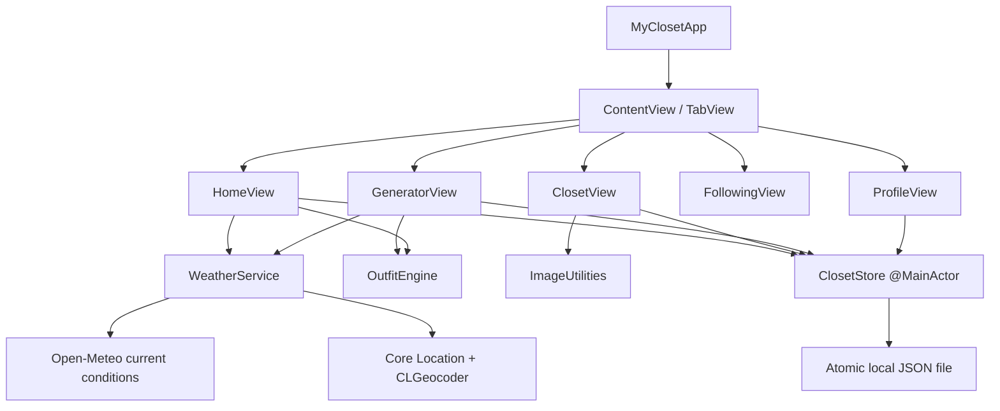
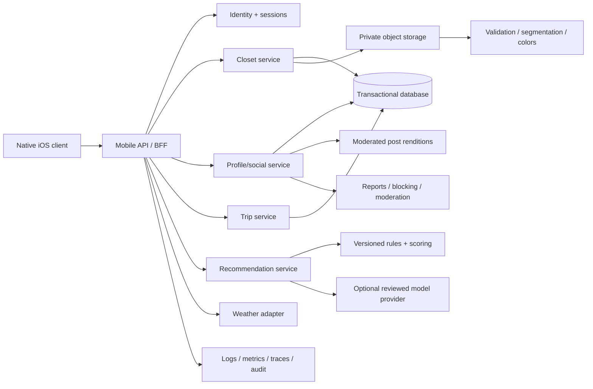

# Architecture

**Status:** Phase 0 implemented; production target documented
**Last reviewed:** 2026-07-14

## 1. Purpose

This document describes the current iPhone prototype, its intentional boundaries, and the target service architecture required by later SRS phases. It is not a claim that future backend components already exist.

## 2. Architectural principles

1. **Privacy is a data boundary.** Public outfit posts must use detached snapshots; a live private closet record is never made public.
2. **Hard constraints are deterministic.** Ownership, authorization, availability, structural validity, locked pieces, and safety cannot be delegated to probabilistic output.
3. **Local usability precedes backend complexity.** The product can validate its core wardrobe loop before identity and social infrastructure exist.
4. **External providers stay behind adapters.** Weather, identity, storage, and future AI providers should be replaceable without rewriting views or business rules.
5. **Offline and degraded states are product states.** The app must explain whether it used current weather, city weather, season, or neutral context.
6. **Historical records use snapshots.** Edits to current closet items do not rewrite what a user saved, wore, packed, or posted previously.

## 3. Current Phase 0 architecture



### 3.1 Presentation

SwiftUI views own temporary presentation state: selected tabs, active filters, form controls, sheet visibility, generator-session locks, and user feedback banners. Views receive long-lived dependencies through environment objects.

Views do not own persistence encoding, weather transport, image sampling, or recommendation business rules.

### 3.2 Application state and persistence

`ClosetStore` is a `@MainActor` observable object and the current application boundary. It owns:

- live closet records;
- saved outfit snapshots;
- worn outfit snapshots;
- the local profile;
- the daily recommendation;
- persistence and sample-data lifecycle.

The store encodes `PersistedCloset` using `Codable` and writes atomically to Application Support. This is appropriate for a prototype with a small local data set. It is not the production synchronization or migration design.

### 3.3 Recommendation engine

`OutfitEngine` is a stateless domain service. Its current pipeline is:

1. Filter deleted/excluded/unavailable records.
2. Validate locked-item availability and category conflicts.
3. Select a valid base structure: top + bottom, or one-piece.
4. Add footwear when available.
5. Add weather/season-relevant outerwear.
6. Optionally add an accessory.
7. Rank category candidates using formality, color compatibility, favorite state, and bounded variety.
8. Emit selected item IDs and an explanation.

Hard constraints and soft scoring are intentionally separate. Tests assert that random selection never breaks locks, availability, exclusions, or structure.

### 3.4 Image pipeline

`ImageUtilities` currently:

- decodes imported images;
- resizes them to a 1,200-pixel maximum dimension;
- compresses them to JPEG;
- samples a 40 × 40 pixel grid;
- maps pixels to a curated clothing palette;
- returns editable dominant and accent suggestions.

Phase 1 must isolate the garment before color sampling, add quality/confidence states, and support user mask/crop correction.

### 3.5 Weather pipeline

`WeatherService` requests foreground approximate location only after user action, geocodes manual cities, and calls a keyless current-weather endpoint. It publishes one `WeatherContext` containing source, temperature, summary, location label, and season.

Fallback order is:

1. current-location weather;
2. manually selected city weather;
3. date/hemisphere season;
4. weather-neutral behavior where future rules require it.

The prototype has no provider cache, quota controls, severe-weather rules, or durable city preference.

## 4. Current data boundaries

| Data | Current storage | Current visibility |
|---|---|---|
| Closet item metadata and image | Local app container | Current device/app only |
| Saved/worn snapshots | Local app container | Current device/app only |
| Profile | Local app container | Current device/app only |
| Generator locks | Memory for active screen session | Current process only |
| Location | Used transiently for explicit weather request | Weather service request only |
| Social content | Not implemented | None |

No production promise should be inferred from local storage. Device backup behavior and platform container protection still apply.

## 5. Target production architecture



### 5.1 Required service boundaries

- **Mobile API/BFF:** token enforcement, request validation, rate limiting, compatibility, and aggregation.
- **Identity:** Apple/Google token verification, internal identity linking, session revocation, deletion lifecycle.
- **Closet:** owner-only metadata, availability, taxonomy, private media authorization.
- **Recommendation:** versioned inputs, hard constraints, scoring, explanations, feedback, fallback.
- **Social:** profiles, follows, blocks, detached post snapshots, feed, deletion.
- **Trust and safety:** reports, review queues, enforcement, appeals, operator audit.
- **Trips:** private trip context, outfit assignments, reuse, packing, overlap conflicts.
- **Media:** validation, malware checks, EXIF stripping, isolation, derivatives, moderation, lifecycle.

### 5.2 Production authorization invariants

1. Every protected request is authorized server-side.
2. Closet ownership is checked independently of UI navigation.
3. A follow relationship never grants closet access.
4. Public posts reference detached, sanitized snapshots and approved renditions.
5. Signed private-media URLs are short-lived and scoped.
6. Operators receive least-privilege, audited, reason-bound access.
7. Account deletion removes provider sessions, public content, private active data, derivatives, and later backup copies according to policy.

## 6. Migration path

Phase 2 should introduce repository protocols before networking:

```swift
protocol ClosetRepository {
    func listItems() async throws -> [ClosetItem]
    func save(_ item: ClosetItem) async throws
    func delete(id: UUID) async throws
}
```

The current store can be split into:

- presentation-facing feature stores;
- local cache/repository;
- remote repositories;
- synchronization coordinator;
- conflict and migration policies.

Migration must preserve the local prototype's generated identifiers or explicitly map them to server identifiers so saved/worn snapshots remain consistent.

## 7. Quality attributes

| Attribute | Architectural response |
|---|---|
| Privacy | owner-scoped services, snapshot isolation, minimization, deletion |
| Reliability | deterministic fallback, queues, idempotency, cached local reads |
| Testability | stateless engine, injectable storage URL, adapters, stable UI identifiers |
| Maintainability | domain models separate from views, versioned phase/ADR documentation |
| Performance | image resizing, bounded data sets, pagination in future APIs |
| Accessibility | native controls, explicit labels, text color names, non-color cues |
| Evolvability | provider adapters, versioned rules, modular feature/service boundaries |

## 8. Known architecture debt

- `ClosetStore` combines repository, application state, and daily recommendation orchestration.
- Persistence has no schema version or migration mechanism.
- Images are embedded as base64 data inside JSON, which will not scale.
- Weather transport is embedded in the service rather than injected behind a protocol.
- Generator variety uses process randomness rather than an injectable random source.
- Explicit feedback is not persisted or applied.
- UI modules are file-separated but not separate Swift packages/targets.

These are accepted Phase 0 tradeoffs and are assigned to later phases; they should not be normalized into the production architecture.

## 9. Decision process

Material changes to authentication, data ownership, storage, recommendation constraints, AI providers, media visibility, or service boundaries require an Architecture Decision Record under `docs/decisions/`.
