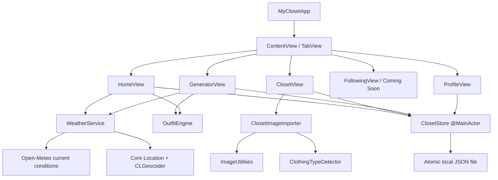
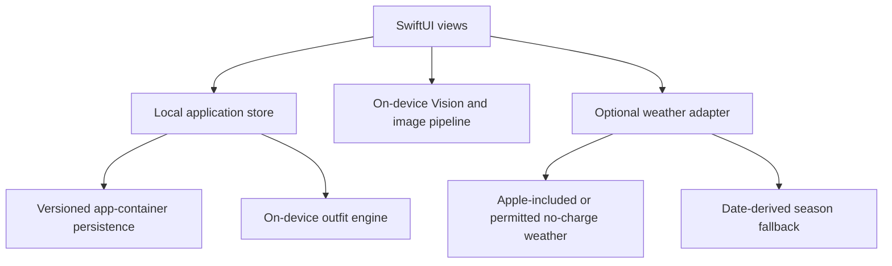
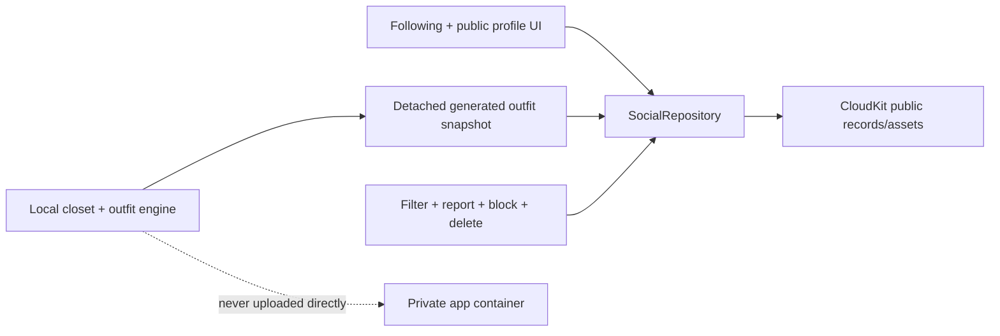

# Architecture

**Status:** Phase 0 implemented; local first release and gated post-release CloudKit social target approved
**Last reviewed:** 2026-08-31

## 1. Purpose

This document describes the current iPhone prototype, the approved local-only first App Store release, and the separately gated post-release CloudKit social architecture.

## 2. Architectural principles

1. **Privacy is local by default.** Wardrobe, launch profile, history, trip, and image data stay in the app container; later public profile fields are explicit detached copies.
2. **Hard constraints are deterministic.** Availability, structural validity, locked pieces, and safety cannot be delegated to probabilistic output.
3. **No backend is a product constraint.** Core functionality cannot depend on hosted storage, accounts, cloud AI, or a paid runtime service.
4. **Optional weather stays behind an adapter.** Live weather can change provider or degrade to season without rewriting views or recommendation rules.
5. **Offline and degraded states are product states.** The app must explain whether it used current weather, city weather, season, or neutral context.
6. **Historical records use snapshots.** Edits to current closet items do not rewrite what a user saved, wore, or packed previously.
7. **Public social data is explicit and detached.** A later CloudKit post cannot reference or expose live closet, trip, preference, or private-history data.

## 3. Current Phase 0 architecture



### 3.1 Presentation

SwiftUI views own temporary presentation state: selected tabs, active filters, form controls, sheet visibility, generator-session locks, and user feedback banners. Views receive long-lived dependencies through environment objects.

Views do not own persistence encoding, weather transport, image sampling, or recommendation business rules.

### 3.2 Application state and persistence

`ClosetStore` is a `@MainActor` observable object and the current application boundary. It owns:

- live closet records;
- saved outfit snapshots;
- worn outfit snapshots;
- the local profile;
- the daily recommendation;
- persistence and sample-data lifecycle.

The store encodes `PersistedCloset` using `Codable` and writes atomically to Application Support. This is appropriate for the small expected audience. Before release, it still needs schema migration and recoverable corruption handling; it does not need synchronization.

### 3.3 Recommendation engine

`OutfitEngine` is a stateless domain service. Its current pipeline is:

1. Filter deleted/excluded/unavailable records.
2. Validate locked-item availability and category conflicts.
3. Select a valid base structure: top + bottom, or one-piece.
4. Add footwear when available.
5. Add weather/season-relevant outerwear.
6. Optionally add an accessory.
7. Rank category candidates using season, formality, color compatibility, favorite state, and bounded variety. If no seasonal or formality match exists for a required slot, fall back to the best available owned piece rather than failing a structurally valid closet.
8. For a full reroll, exclude replaceable pieces as a group and then individually until the engine finds a different valid look; locks and all hard constraints remain authoritative.
9. Emit selected item IDs and an explanation.

Hard constraints and soft scoring are intentionally separate. Tests assert that random selection never breaks locks, availability, exclusions, or structure.

The Generate view starts with no required piece and treats occasion and formality as an optional compact visual brief. Once a look exists, users may lock generated pieces before rerolling. If the imported closet cannot form a valid top-and-bottom or one-piece base, the view reports the available category counts and routes the user to correct editable metadata instead of presenting a silent failure.

### 3.4 Image pipeline

`ImageUtilities` currently:

- decodes imported images;
- resizes them to a 1,200-pixel maximum dimension;
- compresses them to JPEG;
- creates a trimmed transparent PNG rendition from the selected Vision foreground instance, with a conservative multi-color border fallback for runtimes where the OS model is unavailable;
- samples a 64 × 64 pixel grid from the isolated rendition when available, otherwise suppresses a visually consistent border background and omits untrusted accent suggestions;
- maps pixels to a curated clothing palette;
- returns editable dominant and accent suggestions.

`ClothingTypeDetector` first maps descriptive filenames to specific garment kinds. When filenames are unavailable or machine-generated, it combines Apple's on-device foreground-instance mask with conservative semantic signals: silhouette structure drives top-versus-bottom separation, specific footwear labels receive precedence over generic clothing, and semantic labels are retained only where they proved dependable. `ImageUtilities` reuses the chosen mask for a local transparent rendition so palette sampling and body-aligned outfit composition can exclude the photographed background. When that OS model is unavailable, a multi-color border model removes only a credible centered foreground and rejects ambiguous output. `ClosetImageImporter` combines these signals into editable name, category, kind-aware season, formality, and color defaults; the guided review includes a quick crop fallback and the Closet UI can explicitly re-analyze older photographed records without changing curated non-analysis fields.

The remaining Phase 1 pipeline must add quality/confidence states, brush-based mask correction, rotation/reset, direct guided capture, physical-device qualification, and file-backed media persistence with schema migration.

### 3.5 Weather pipeline

`WeatherService` requests foreground approximate location only after user action, geocodes manual cities, and calls a keyless current-weather endpoint. It publishes one `WeatherContext` containing source, temperature, summary, location label, and season.

Fallback order is:

1. current-location weather;
2. manually selected city weather;
3. date/hemisphere season;
4. weather-neutral behavior where future rules require it.

The prototype has no provider cache, quota controls, severe-weather rules, or durable city preference.

## 4. Current data boundaries

| Data | Current storage | Current visibility |
|---|---|---|
| Closet item metadata and image | Local app container | Current device/app only |
| Saved/worn snapshots | Local app container | Current device/app only |
| Profile | Local app container | Current device/app only |
| Following | No data source | Static Coming Soon presentation only |
| Generator locks | Memory for active screen session | Current process only |
| Location | Used transiently for explicit weather request | Weather service request only |

The release must explain that no myCloset cloud backup or cross-device recovery exists. Device backup behavior and platform container protection still apply.

## 5. Approved App Store architecture



### 5.1 Required boundaries

- **Views:** temporary interaction state only.
- **Local store/repository:** profile, closet, history, feedback, and future trips with atomic writes and migrations.
- **Recommendation engine:** versioned hard constraints and soft scoring that never fabricate items.
- **Image pipeline:** local validation, resizing, segmentation, colors, and editable suggestions.
- **Weather adapter:** foreground location/city lookup with season and neutral fallbacks.
- **Release diagnostics:** Apple-provided crash/performance information and user-supplied support details only; no third-party analytics dependency.

### 5.2 Release invariants

1. Core behavior works without an account or network connection.
2. Private wardrobe and profile media are not uploaded to a developer-operated service.
3. Outfit and image intelligence have no per-use API charge.
4. Live-weather failure never prevents generation.
5. Clear Local Data removes applicable user content from the app container.
6. ADR-0004 permits only the gated post-release CloudKit social scope; a conventional backend, cloud AI, private data upload, broader public media, or recurring provider charge requires a new ADR and product-owner approval.

## 6. Post-release CloudKit social architecture

Phase 7 may be implemented only after release interest and safety gates pass:



Required boundaries:

- iCloud identity is used only to scope social ownership; local wardrobe features remain account-free.
- Public profiles initially use app-specific handles and preset avatars.
- Public posts initially use locally generated detached outfit compositions, not arbitrary body/profile photographs.
- `SocialRepository` isolates CloudKit from views and makes failure, testing, and kill-switch behavior explicit.
- CloudKit public records contain no live closet IDs, original garment media, trips, feedback, precise location, or private history.
- Filtering, reporting, blocking, deletion, public policies/contact, and manual moderation must exist before social writes are enabled.
- Social writes can be disabled without affecting local closet, generation, history, weather fallback, or trips.

## 7. Local persistence evolution

Before App Store release, introduce repository boundaries and schema migration without adding networking:

```swift
protocol ClosetRepository {
    func listItems() async throws -> [ClosetItem]
    func save(_ item: ClosetItem) async throws
    func delete(id: UUID) async throws
}
```

The current store can be split into:

- presentation-facing feature stores;
- local repositories for metadata and image files;
- migration and corruption-recovery policies.

Migration must preserve stable identifiers so saved/worn/trip snapshots remain consistent.

## 8. Quality attributes

| Attribute | Architectural response |
|---|---|
| Privacy | app-container storage, data minimization, local deletion |
| Reliability | deterministic fallback, atomic writes, migrations, local reads |
| Testability | stateless engine, injectable storage URL, adapters, stable UI identifiers |
| Maintainability | domain models separate from views, versioned phase/ADR documentation |
| Performance | image resizing and bounded local data sets |
| Accessibility | native controls, explicit labels, text color names, non-color cues |
| Evolvability | weather adapter, versioned rules, repository boundaries, optional CloudKit social repository |

## 9. Known architecture debt

- `ClosetStore` combines repository, application state, and daily recommendation orchestration.
- Persistence has no schema version or migration mechanism.
- Images are embedded as data inside JSON, which is inefficient for larger local closets.
- Weather transport is embedded in the service rather than injected behind a protocol.
- Generator variety uses process randomness rather than an injectable random source.
- Explicit feedback is not persisted or applied.
- UI modules are file-separated but not separate Swift packages/targets.

These are accepted Phase 0 tradeoffs and are assigned to later local phases; they should not be normalized into the App Store architecture.

## 10. Decision process

Material changes to authentication, data ownership, storage, recommendation constraints, AI providers, media visibility, or service boundaries require an Architecture Decision Record under `docs/decisions/`.
