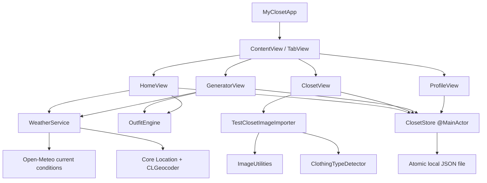
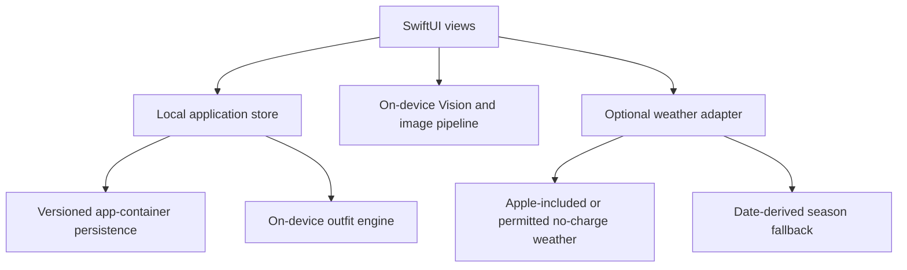

# Architecture

**Status:** Phase 0 implemented; zero-backend App Store target approved
**Last reviewed:** 2026-07-14

## 1. Purpose

This document describes the current iPhone prototype and the approved local-only App Store architecture. Cloud and social systems are optional unfunded ideas, not release dependencies.

## 2. Architectural principles

1. **Privacy is local by default.** Wardrobe, profile, history, trip, and image data stay in the app container.
2. **Hard constraints are deterministic.** Availability, structural validity, locked pieces, and safety cannot be delegated to probabilistic output.
3. **No backend is a product constraint.** Core functionality cannot depend on hosted storage, accounts, cloud AI, or a paid runtime service.
4. **Optional weather stays behind an adapter.** Live weather can change provider or degrade to season without rewriting views or recommendation rules.
5. **Offline and degraded states are product states.** The app must explain whether it used current weather, city weather, season, or neutral context.
6. **Historical records use snapshots.** Edits to current closet items do not rewrite what a user saved, wore, or packed previously.

## 3. Current Phase 0 architecture



### 3.1 Presentation

SwiftUI views own temporary presentation state: selected tabs, active filters, form controls, sheet visibility, generator-session locks, and user feedback banners. Views receive long-lived dependencies through environment objects.

Views do not own persistence encoding, weather transport, image sampling, or recommendation business rules.

### 3.2 Application state and persistence

`ClosetStore` is a `@MainActor` observable object and the current application boundary. It owns:

- live closet records;
- saved outfit snapshots;
- worn outfit snapshots;
- the local profile;
- the daily recommendation;
- persistence and sample-data lifecycle.

The store encodes `PersistedCloset` using `Codable` and writes atomically to Application Support. This is appropriate for the small expected audience. Before release, it still needs schema migration and recoverable corruption handling; it does not need synchronization.

### 3.3 Recommendation engine

`OutfitEngine` is a stateless domain service. Its current pipeline is:

1. Filter deleted/excluded/unavailable records.
2. Validate locked-item availability and category conflicts.
3. Select a valid base structure: top + bottom, or one-piece.
4. Add footwear when available.
5. Add weather/season-relevant outerwear.
6. Optionally add an accessory.
7. Rank category candidates using formality, color compatibility, favorite state, and bounded variety.
8. Emit selected item IDs and an explanation.

Hard constraints and soft scoring are intentionally separate. Tests assert that random selection never breaks locks, availability, exclusions, or structure.

### 3.4 Image pipeline

`ImageUtilities` currently:

- decodes imported images;
- resizes them to a 1,200-pixel maximum dimension;
- compresses them to JPEG;
- samples a 40 × 40 pixel grid;
- maps pixels to a curated clothing palette;
- returns editable dominant and accent suggestions.

`ClothingTypeDetector` first maps descriptive filenames to the wardrobe taxonomy, then uses Apple's on-device general image classifier when filenames are unavailable. `TestClosetImageImporter` combines those suggestions with image preparation and conservative season/formality defaults. Classification remains advisory: the UI reports uncertain batches and every imported record stays editable.

Phase 1 must isolate the garment before color sampling, add quality/confidence states, and support user mask/crop correction.

### 3.5 Weather pipeline

`WeatherService` requests foreground approximate location only after user action, geocodes manual cities, and calls a keyless current-weather endpoint. It publishes one `WeatherContext` containing source, temperature, summary, location label, and season.

Fallback order is:

1. current-location weather;
2. manually selected city weather;
3. date/hemisphere season;
4. weather-neutral behavior where future rules require it.

The prototype has no provider cache, quota controls, severe-weather rules, or durable city preference.

## 4. Current data boundaries

| Data | Current storage | Current visibility |
|---|---|---|
| Closet item metadata and image | Local app container | Current device/app only |
| Saved/worn snapshots | Local app container | Current device/app only |
| Profile | Local app container | Current device/app only |
| Generator locks | Memory for active screen session | Current process only |
| Location | Used transiently for explicit weather request | Weather service request only |

The release must explain that no myCloset cloud backup or cross-device recovery exists. Device backup behavior and platform container protection still apply.

## 5. Approved App Store architecture



### 5.1 Required boundaries

- **Views:** temporary interaction state only.
- **Local store/repository:** profile, closet, history, feedback, and future trips with atomic writes and migrations.
- **Recommendation engine:** versioned hard constraints and soft scoring that never fabricate items.
- **Image pipeline:** local validation, resizing, segmentation, colors, and editable suggestions.
- **Weather adapter:** foreground location/city lookup with season and neutral fallbacks.
- **Release diagnostics:** Apple-provided crash/performance information and user-supplied support details only; no third-party analytics dependency.

### 5.2 Release invariants

1. Core behavior works without an account or network connection.
2. Private wardrobe and profile media are not uploaded to a developer-operated service.
3. Outfit and image intelligence have no per-use API charge.
4. Live-weather failure never prevents generation.
5. Clear Local Data removes applicable user content from the app container.
6. Adding a backend, cloud AI, public content, or recurring provider charge requires a new ADR and product-owner approval.

## 6. Local persistence evolution

Before App Store release, introduce repository boundaries and schema migration without adding networking:

```swift
protocol ClosetRepository {
    func listItems() async throws -> [ClosetItem]
    func save(_ item: ClosetItem) async throws
    func delete(id: UUID) async throws
}
```

The current store can be split into:

- presentation-facing feature stores;
- local repositories for metadata and image files;
- migration and corruption-recovery policies.

Migration must preserve stable identifiers so saved/worn/trip snapshots remain consistent.

## 7. Quality attributes

| Attribute | Architectural response |
|---|---|
| Privacy | app-container storage, data minimization, local deletion |
| Reliability | deterministic fallback, atomic writes, migrations, local reads |
| Testability | stateless engine, injectable storage URL, adapters, stable UI identifiers |
| Maintainability | domain models separate from views, versioned phase/ADR documentation |
| Performance | image resizing and bounded local data sets |
| Accessibility | native controls, explicit labels, text color names, non-color cues |
| Evolvability | weather adapter, versioned rules, repository boundaries |

## 8. Known architecture debt

- `ClosetStore` combines repository, application state, and daily recommendation orchestration.
- Persistence has no schema version or migration mechanism.
- Images are embedded as data inside JSON, which is inefficient for larger local closets.
- Weather transport is embedded in the service rather than injected behind a protocol.
- Generator variety uses process randomness rather than an injectable random source.
- Explicit feedback is not persisted or applied.
- UI modules are file-separated but not separate Swift packages/targets.

These are accepted Phase 0 tradeoffs and are assigned to later local phases; they should not be normalized into the App Store architecture.

## 9. Decision process

Material changes to authentication, data ownership, storage, recommendation constraints, AI providers, media visibility, or service boundaries require an Architecture Decision Record under `docs/decisions/`.
