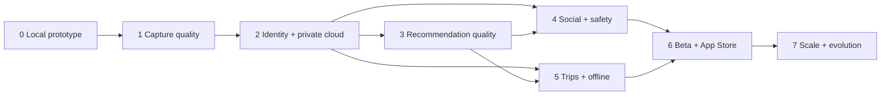

# Product and Engineering Roadmap

**Baseline:** SRS 1.0
**Current phase:** Phase 0 complete; Phase 1 next
**Planning model:** exit-gate driven, not date-driven

## 1. Roadmap objective

The roadmap sequences myCloset so that each phase produces a testable product increment while establishing the privacy, safety, and operational dependencies required by the next phase. A phase is complete only when its documented exit evidence exists.

## 2. Sequencing principles

1. Improve wardrobe input quality before spending heavily on recommendation intelligence.
2. Build identity and private-data authorization before real social features.
3. Build reporting, blocking, moderation, and deletion with social publishing, not afterward.
4. Keep a useful local/degraded product throughout backend introduction.
5. Treat App Store readiness as an operational phase, not a final metadata task.
6. Use measured user outcomes to justify Phase 7 complexity.

## 3. Phase overview

| Phase | Name | Primary outcome | Status | Depends on |
|---:|---|---|---|---|
| 0 | Local Prototype and Foundation | Validate the wardrobe-to-outfit loop | Complete | SRS baseline |
| 1 | Capture and Wardrobe Quality | Produce reliable isolated garment records | Next | Phase 0 |
| 2 | Cloud Identity and Private Data | Secure accounts, sync, deletion, private media | Planned | Phase 1 data model |
| 3 | Recommendation Quality | Reliable personalization and explainability | Planned | Phase 2 event/data foundation |
| 4 | Social and Safety | Safe profile/follow/post experience | Planned | Phase 2 identity/media; Phase 3 snapshots |
| 5 | Trips and Offline | Multi-outfit travel planning and sync | Planned | Phase 2 sync; Phase 3 generation |
| 6 | Beta and App Store Release | Operable, compliant public release | Planned | Phases 1–5 P0 scope |
| 7 | Scale and Product Evolution | Measured expansion without weakening trust | Future | Production evidence |

## 4. Cross-phase quality gates

Every phase must provide:

- linked SRS requirements and explicit exclusions;
- approved UX states for empty, loading, offline, denied, and failure conditions;
- automated tests at the lowest effective layer;
- accessibility verification for changed critical journeys;
- security/privacy analysis for changed data flows;
- analytics or operational evidence appropriate to the phase;
- migration and rollback notes;
- updated README, roadmap, phase document, traceability, and changelog.

## 5. Milestone dependency map

## 6. Phase summaries

### Phase 0 — Local Prototype and Foundation

Delivered a native, locally persistent prototype with wardrobe CRUD, color suggestions, weather/season context, outfit generation, locking, rerolling, saved/worn history, profile editing, documentation, CI, and automated tests.

Exit evidence: [Phase 0 document](phases/PHASE_0_LOCAL_PROTOTYPE.md) and [Prototype Status](../PROTOTYPE_STATUS.md).

### Phase 1 — Capture and Wardrobe Quality

Deliver direct guided camera capture, Vision foreground segmentation, adjustable masks/crops, quality checks, isolated color extraction, schema versioning, richer taxonomy, and capture accessibility. The result is a trustworthy private garment record.

Exit gate: supported garment categories meet agreed segmentation/color accuracy thresholds and users can recover every automated failure manually.

### Phase 2 — Cloud Identity and Private Data

Deliver Sign in with Apple/Google, identity linking, server-side authorization, private object storage, sync, export/deletion, session controls, auditability, and a secure local-to-cloud migration.

Exit gate: multi-account isolation and deletion pass adversarial tests; no social capability is enabled yet.

### Phase 3 — Recommendation Quality

Deliver versioned deterministic rules, richer weather/occasion inputs, explicit feedback, preference controls, reproducible results, confidence/explanations, provider fallbacks, and measured recommendation quality.

Exit gate: locks/ownership/availability/structure remain invariant and beta users meet an approved acceptance-rate target.

### Phase 4 — Social and Safety

Deliver searchable profiles, following, detached outfit posts, reverse-chronological feed, reporting, blocking, moderation, enforcement audit, community guidelines, deletion propagation, and abuse controls. Likes/comments remain excluded.

Exit gate: trust-and-safety response operations exist and public content cannot reveal live closet/trip data.

### Phase 5 — Trips and Offline

Deliver private trips, destination/date context, multiple generated outfits, item reuse, unique packing lists, availability conflicts, offline cached access, queued mutations, and synchronization conflict handling.

Exit gate: trip plans survive network loss and cross-device conflict tests without duplicate or lost state.

### Phase 6 — Beta and App Store Release

Deliver internal/external TestFlight, release security/privacy/accessibility audits, performance/reliability evidence, operational dashboards/runbooks, support/moderation readiness, store assets, legal documents, signing, reviewer flow, and staged production rollout.

Exit gate: every SRS P0 release gate is evidenced or formally waived by an accountable owner.

### Phase 7 — Scale and Product Evolution

Use production evidence to prioritize localization, advanced on-device personalization, analytics insights, optional calendar integration, wear/cost analytics, and scale improvements. Avoid speculative complexity.

Exit gate: each expansion has measurable value, privacy review, rollback, and sustainable cost.

## 7. Scope control

New ideas enter the roadmap only when they include:

- the user problem and evidence;
- affected SRS requirements or proposed amendment;
- phase/dependency placement;
- privacy and safety impact;
- expected operational cost;
- minimum test and success criteria;
- what is explicitly not included.

Urgent security or data-integrity work may interrupt the roadmap. Cosmetic additions should not bypass missing privacy, authorization, moderation, or reliability foundations.

## 8. Progress reporting

Phase status uses four values:

- **Planned:** scope exists but entry criteria are not met.
- **Ready:** dependencies and design decisions are sufficient to start.
- **In progress:** implementation is active with an accountable owner.
- **Complete:** exit criteria have linked evidence.

Update this roadmap and the README in the same pull request that changes a phase status.
