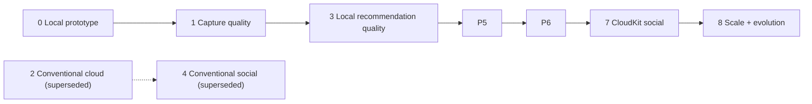

# Product and Engineering Roadmap

**Baseline:** SRS 1.3
**Current phase:** Phase 0 complete; Phase 1 in progress
**Planning model:** exit-gate driven, not date-driven

## 1. Roadmap objective

The roadmap sequences myCloset so that each phase produces a testable product increment while establishing the privacy, safety, and operational dependencies required by the next phase. A phase is complete only when its documented exit evidence exists.

## 2. Sequencing principles

1. Improve wardrobe input quality before spending heavily on recommendation intelligence.
2. Keep core behavior, intelligence, photos, and user data on-device.
3. Introduce no mandatory recurring service charge beyond Apple Developer Program membership.
4. Keep conventional identity/backend work as P2; treat CloudKit social as a gated post-release P1 addition.
5. Treat App Store readiness as an operational phase, not a final metadata task.
6. Use friend/beta feedback to justify any later complexity or cost.

## 3. Phase overview

| Phase | Name | Primary outcome | Status | Depends on |
|---:|---|---|---|---|
| 0 | Local Prototype and Foundation | Validate the wardrobe-to-outfit loop | Complete | SRS baseline |
| 1 | Capture and Wardrobe Quality | Produce reliable isolated garment records | In progress | Phase 0 |
| 2 | Conventional Cloud Identity and Private Data | Superseded backend/account reference design | **Superseded** | A new ADR only if CloudKit is insufficient |
| 3 | Recommendation Quality | Better local personalization and explainability | Planned | Phase 1 wardrobe quality |
| 4 | Conventional Social and Safety | Superseded server-based social reference design | **Superseded** | A new ADR only if CloudKit is insufficient |
| 5 | Local Trips and Offline | Multi-outfit travel planning stored on-device | Planned | Phase 3 generation |
| 6 | Beta and App Store Release | Compliant zero-backend public release | Planned | Phases 1, 3, and approved local scope |
| 7 | Post-Release CloudKit Social | Low-cost profiles, following, feed, and safety | Planned — post-release gated | Phase 6 plus interest and safety gates |
| 8 | Scale and Product Evolution | Measured expansion without weakening trust | Future | Production evidence |

## 4. Cross-phase quality gates

Every phase must provide:

- linked SRS requirements and explicit exclusions;
- approved UX states for empty, loading, offline, denied, and failure conditions;
- automated tests at the lowest effective layer;
- accessibility verification for changed critical journeys;
- security/privacy analysis for changed data flows;
- analytics or operational evidence appropriate to the phase;
- migration and rollback notes;
- updated README, roadmap, phase document, traceability, and changelog.

## 5. Milestone dependency map

## 6. Phase summaries

### Phase 0 — Local Prototype and Foundation

Delivered a native, locally persistent prototype with wardrobe CRUD, color suggestions, weather/season context, outfit generation, locking, rerolling, saved/worn history, profile editing, documentation, CI, and automated tests.

Exit evidence: [Phase 0 document](phases/PHASE_0_LOCAL_PROTOTYPE.md) and [Prototype Status](../PROTOTYPE_STATUS.md).

### Phase 1 — Capture and Wardrobe Quality

The current slices require the user to lasso every new imported or replacement photo before metadata confirmation. After tracing, experimental on-device edge refinement uses the outline to guide Vision instance selection or conservative local color refinement. Users compare the suggested transparent cutout with their original outline before applying; failed analysis keeps the original. The saved transparent rendition keeps the user-approved source pixels, excludes the photographed background, drives garment-only color sampling and body-aligned outfit composition, and supports retrace, multiple regions, rotate, and reset. The flow also supplies 29 persisted selectable garment types with matching editable name/season/formality defaults, specific-type filters, hold-menu deletion, shoe-pair outline guidance, batch progress, confidence guidance, skip recovery, import summaries, and batch or single-item re-analysis. Continue with direct guided camera capture, point/edge and undo refinement for lasso masks, calibrated quality/confidence states, schema and taxonomy versioning, and capture accessibility. The result is a trustworthy private garment record.

Exit gate: supported garment categories meet agreed segmentation/color accuracy thresholds and users can recover every automated failure manually.

### Phase 2 — Conventional Cloud Identity and Private Data

This server-based phase is superseded by ADR-0004 and retained only as a reference design. It is not required for App Store release or the approved CloudKit social addition. It may be reconsidered only if CloudKit cannot meet a demonstrated requirement and the product owner explicitly accepts recurring infrastructure, security, privacy, support, and migration costs.

Exit gate if reactivated: multi-account isolation and deletion pass adversarial tests; no social capability is enabled yet.

### Phase 3 — Recommendation Quality

The current prototype implements the SRS 1.3 / ADR-0005 rule that a jacket replaces the top in separates, including locked-piece and reroll behavior. Phase 3 still needs versioned on-device deterministic rules, richer weather/occasion inputs, explicit local feedback, preference controls, reproducible results, confidence/explanations, and provider-independent fallbacks.

Exit gate: locks/ownership/availability/structure remain invariant and beta users meet an approved acceptance-rate target.

### Phase 4 — Conventional Social and Safety

This server-based phase is superseded by the narrower Phase 7 CloudKit social plan. It remains useful as a reference for a future multi-platform service but is not an approved dependency. Likes/comments remain excluded in either architecture.

Exit gate: trust-and-safety response operations exist and public content cannot reveal live closet/trip data.

### Phase 5 — Trips and Offline

Deliver private local trips, destination/date context, multiple generated outfits, item reuse, unique packing lists, availability conflicts, and offline persistence without accounts or synchronization.

Exit gate: trip plans survive network loss and app relaunch without duplicate or lost state.

### Phase 6 — Beta and App Store Release

Deliver internal/external TestFlight, local-data security/privacy/accessibility audits, performance/reliability evidence, support readiness, store assets, legal documents, signing, reviewer flow, and staged rollout with no production backend.

Exit gate: every applicable local-only SRS P0 release gate is evidenced or formally waived, and the cost review confirms no mandatory recurring service beyond Apple Developer Program membership.

### Phase 7 — Post-Release CloudKit Social

After the local App Store release demonstrates interest, deliver iCloud-scoped public profiles, handles, preset avatars, following, a reverse-chronological feed, and explicit generated-outfit composition posts through CloudKit. Private closet data remains local. Reporting, blocking, filtering, deletion, public policies/contact, manual moderation, quota monitoring, and a kill switch are part of the slice, not follow-up work.

Exit gate: social activation passes the interest gate, CloudKit access-control and detached-snapshot tests, the complete follow/block/report matrix, App Store user-generated-content review, and the Apple-membership-only cost check.

### Phase 8 — Scale and Product Evolution

Use production evidence to prioritize localization, advanced on-device personalization, analytics insights, optional calendar integration, wear/cost analytics, and scale improvements. Avoid speculative complexity.

Exit gate: each expansion has measurable value, privacy review, rollback, and sustainable cost.

## 7. Scope control

New ideas enter the roadmap only when they include:

- the user problem and evidence;
- affected SRS requirements or proposed amendment;
- phase/dependency placement;
- privacy and safety impact;
- expected operational cost;
- minimum test and success criteria;
- what is explicitly not included.

Urgent security or data-integrity work may interrupt the roadmap. Cosmetic additions should not bypass missing privacy, authorization, moderation, or reliability foundations.

## 8. Progress reporting

Phase status uses five values:

- **Planned:** scope exists but entry criteria are not met.
- **Ready:** dependencies and design decisions are sufficient to start.
- **In progress:** implementation is active with an accountable owner.
- **Complete:** exit criteria have linked evidence.
- **Superseded:** retained for traceability but replaced by an approved architecture or phase.

Update this roadmap and the README in the same pull request that changes a phase status.
