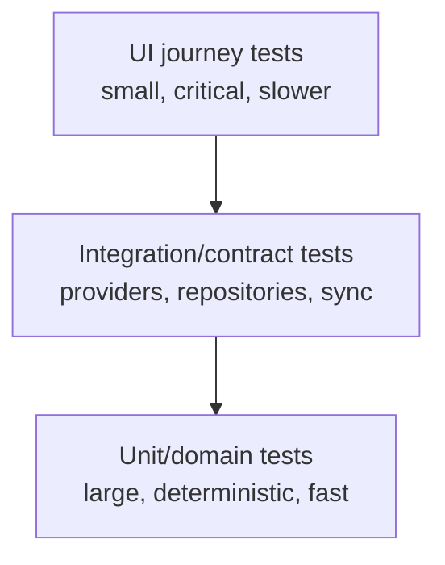

# Testing Strategy and Guide

**Current automated inventory:** 56 unit tests + 5 UI tests
**Current verified environment:** Xcode 26.3, iPhone 17 simulator, iOS 26.3.1
**Minimum deployment target:** iOS 17.0

Latest recorded evidence: [Test Execution Report — 2026-09-01](testing/TEST_EXECUTION_2026-09-01.md) (61 passed, 0 failed).

## 1. Objectives

Testing must demonstrate that myCloset:

- never fabricates or leaks closet pieces;
- preserves locked and unavailable-item rules under rerolling;
- produces structurally valid outfits or actionable failures;
- retains private local content correctly across relaunches;
- preserves historical snapshots after live item edits;
- handles image and metadata failures safely;
- keeps critical iPhone journeys usable and accessible;
- keeps applicable user data local and proves local deletion and degraded operation.

## 2. Test layers



Phase 0 emphasizes deterministic domain and store tests, with a small UI smoke suite. Later approved phases add local media-pipeline, migration, performance, security, accessibility, trip, and App Store qualification tests. Phase 7 must add CloudKit ownership, detached-snapshot, follow/block/report/delete, moderation, quota, and failure suites before social activation.

## 3. Automated suite inventory

### 3.1 `OutfitEngineTests` — 14 tests

| Coverage | SRS relationship |
|---|---|
| Empty closet failure | HOME-008, REC-016 |
| Complete top/bottom/footwear structure | COMP-001–COMP-003 |
| Locked-piece retention across repeated generation | COMP-005–COMP-010 |
| Unavailable-item exclusion | CLO-006–CLO-008, COMP-004 |
| Explicit session exclusion | COMP-011–COMP-013 |
| Same-slot lock conflict | COMP-006–COMP-007 |
| One-piece/separates conflict | COMP-001, COMP-007 |
| Unavailable locked conflict | COMP-007 |
| Missing category explanation | HOME-008, COMP-014 |
| Season preference fallback to the best owned piece | REC-003–REC-007, REC-016 |
| One-piece fallback when separates are incomplete | COMP-001–COMP-003, REC-016 |
| Cold-weather outerwear | REC-003–REC-004 |
| Explanation includes lock and weather | COMP-017, REC-008 |
| Alternative generation changes an eligible slot without breaking locks | COMP-009–COMP-013 |

### 3.2 `ClosetStoreTests` — 12 tests

| Coverage | SRS relationship |
|---|---|
| Atomic persistence/reload | OFF-001, REL-007 |
| Batch import persistence | ITEM-006, OFF-001 |
| Normalized duplicate-name warning | ITEM-013–ITEM-014 |
| Edit exclusion from duplicate warning | ITEM-013 |
| Complete twelve-piece sample fixture | Prototype verification |
| Idempotent sample loading | Data integrity |
| Complete legacy demo cleanup while preserving imported items | CLO-001, OFF-001 |
| Archive visibility | CLO-006, CLO-009 |
| Laundry/unavailable filtering | CLO-006–CLO-008 |
| Saved-outfit deduplication | HIST-001, HIST-009 |
| Immutable worn snapshots | CLO-010, HIST-003 |
| Full local reset | Account/deletion precursor |

### 3.3 `ModelsAndImageTests` — 14 tests

| Coverage | SRS relationship |
|---|---|
| Northern/southern season mapping | WEA-007–WEA-008 |
| Formality ordering | GEN-005–GEN-006 |
| Temperature display rounding | UX/weather presentation |
| Nearest clothing color | ITEM-009–ITEM-011 |
| Historical snapshot copy | HIST-003 |
| Maximum image dimension | PERF-007 |
| Dominant red extraction | ITEM-009–ITEM-010 |
| Plain-background suppression during color extraction | ITEM-009–ITEM-010 |
| Perceptual dark-neutral classification | ITEM-009–ITEM-011 |
| Insignificant accent suppression and meaningful accent retention | ITEM-009–ITEM-011 |
| Vision 32-bit foreground-mask decoding | ITEM-007–ITEM-010 |
| Invalid-image graceful failure | ITEM-019 |

### 3.4 `ClothingTypeDetectorTests` — 16 tests

| Coverage | SRS relationship |
|---|---|
| Filename mapping across all garment categories | ITEM-007–ITEM-008 |
| Human-readable imported names | ITEM-001, ITEM-013 |
| Generic camera-name fallback | ITEM-001 |
| Machine-generated filename replacement with color-aware name | ITEM-001, ITEM-007–ITEM-010 |
| Garment-kind season/formality defaults | ITEM-015–ITEM-018 |
| End-to-end editable importer defaults | ITEM-001, ITEM-007–ITEM-018 |
| Reliable footwear labels outrank generic clothing results; uncertain unmasked results require review | ITEM-007–ITEM-008 |
| Leg-split and compact-open silhouettes identify trousers and shorts | ITEM-007–ITEM-008 |
| Strong denim labels and compact center openings cannot turn a jacket-shaped garment into a bottom | ITEM-007–ITEM-008 |
| Jacket and hoodie labels produce editable outerwear suggestions | ITEM-007–ITEM-008 |
| Confirmed category/color metadata produces a synchronized default name | ITEM-001, ITEM-007–ITEM-011 |

The suite keeps OS-owned Vision at the boundary and tests the deterministic structural interpretation separately, because Apple's exact semantic labels may evolve between system releases.

### 3.5 `MyClosetUITests` — 5 tests

| Journey | Primary assertion |
|---|---|
| Empty closet → own-image import | Real users start without demo garments and can reach personal photo import |
| Closet → generator → visual brief → outfit | Stored pieces produce an unlocked outfit without a starting-piece prompt, accept a visual Work brief, and retain generated-piece lock controls |
| Closet piece → metadata editor | Imported/stored item exposes editable name and metadata controls |
| Import suggestions → required review → closet | Category changes update the generated name, a manual rename disables later auto-renaming, and the corrected piece is added only after confirmation |
| Following tab → Coming Soon | Social roadmap is visible without fake profiles, posts, or service behavior |

## 4. Running tests

### 4.1 Full suite

```sh
xcodebuild \
  -project myCloset.xcodeproj \
  -scheme myCloset \
  -destination 'platform=iOS Simulator,name=iPhone 17 Pro,OS=latest' \
  -derivedDataPath /tmp/myClosetTestDerivedData \
  test
```

### 4.2 Unit only

```sh
xcodebuild \
  -project myCloset.xcodeproj \
  -scheme myCloset \
  -destination 'platform=iOS Simulator,name=iPhone 17 Pro,OS=latest' \
  -derivedDataPath /tmp/myClosetTestDerivedData \
  -only-testing:myClosetTests \
  test
```

### 4.3 UI only

```sh
xcodebuild \
  -project myCloset.xcodeproj \
  -scheme myCloset \
  -destination 'platform=iOS Simulator,name=iPhone 17 Pro,OS=latest' \
  -derivedDataPath /tmp/myClosetTestDerivedData \
  -only-testing:myClosetUITests \
  test
```

### 4.4 Result bundle and coverage

```sh
xcodebuild \
  -project myCloset.xcodeproj \
  -scheme myCloset \
  -destination 'platform=iOS Simulator,name=iPhone 17 Pro,OS=latest' \
  -enableCodeCoverage YES \
  -resultBundlePath /tmp/myClosetTests.xcresult \
  test
```

Inspect with Xcode or `xcrun xcresulttool`.

## 5. Determinism and isolation

- Unit stores receive a unique temporary storage URL.
- Tests do not share production application-support data.
- UI tests use debug-only reset/sample launch arguments.
- Unit tests do not call live weather, location, identity, or cloud services.
- Repeated randomized engine tests assert invariants rather than one exact outfit.
- Future ranking should accept an injectable random source for fully reproducible score-order tests.

## 6. CI

`.github/workflows/ios.yml` runs on `macos-15` with Xcode 26.3, uses the shared scheme and test plan, validates required documentation, builds, and runs the complete suite on an available iPhone simulator. The workflow uploads the result bundle when tests fail.

The runner image and available simulator set change over time. The workflow uses a currently available iPhone 17 Pro/latest runtime and should be updated together with this document if GitHub changes its image inventory.

## 7. Quality gates

### Every pull request

- project parses and builds;
- all existing tests pass;
- new/changed behavior has coverage;
- no focused, skipped, or disabled test is committed without an issue and rationale;
- required documents exist and changed behavior updates documentation;
- no secret or private test data is introduced.

### Phase completion

- phase-specific acceptance matrix passes;
- critical journeys pass UI and manual accessibility testing;
- regression suite passes on minimum and current supported iOS versions where infrastructure allows;
- security/privacy tests for new data boundaries pass;
- performance/reliability targets have evidence;
- unresolved high-severity defects have accountable, time-bound exceptions.

## 8. Coverage targets

Coverage percentage is a diagnostic, not the definition of quality. Targets:

- recommendation hard constraints: 100% rule/branch coverage;
- persistence migrations and deletion: 100% success and failure-path coverage;
- domain/application logic: at least 85% line coverage by Phase 3;
- view rendering: cover critical journeys rather than chasing generated-body line percentages;
- authorization and multi-user privacy policies: excluded from the approved release; complete an allow/deny matrix only if the deferred backend is explicitly reactivated.

## 9. Manual test charters

### Closet and media

- very light/dark garments;
- patterned and multi-color items;
- plain and busy backgrounds;
- portrait/landscape/large images;
- Photos permission denial and limited library;
- duplicate names and rapid repeated save;
- archive/laundry/unavailable transitions.

### Generator

- insufficient categories;
- multiple locks in same slot;
- locked one-piece plus separates;
- no replacement candidate;
- weather extremes and season mismatch;
- every occasion and formality edge;
- repeated rerolls and undo behavior;
- save/worn snapshot after rename/delete.

### Accessibility

- VoiceOver reading and action order;
- maximum Dynamic Type;
- Reduce Motion;
- light/dark appearance and contrast;
- non-color status cues;
- external keyboard/switch access where applicable.

### Reliability

- relaunch during item editing;
- network loss during weather request;
- provider timeout/malformed response;
- low storage and corrupt persistence fixture;
- app upgrade with prior schema data.

## 10. Future test suites by phase

| Phase | Required additions |
|---:|---|
| 1 | segmentation golden set, mask correction, color confidence, camera permission, corrupt/large media |
| 2 | auth token validation, identity linking, multi-user isolation, signed media, migration, export, deletion, session revocation |
| 3 | rule-version replay, feedback weighting, provider fallback, free-text interpretation contract, recommendation evaluation set |
| 4 | follows/blocks matrix, snapshot privacy, report lifecycle, moderation audit, feed pagination, abuse/rate limits |
| 5 | trip reuse, unique packing items, overlapping conflicts, offline queue, merge/conflict resolution |
| 6 | load/soak, restore, penetration test, privacy/accessibility audit, TestFlight and App Store acceptance |

## 11. Test maintenance

When adding or removing tests:

1. keep names behavior-oriented;
2. update the inventory and README count;
3. avoid sleeps; wait for observable conditions;
4. use fixtures without personal images or production data;
5. keep failure messages actionable;
6. link regressions to their issue/requirement where useful.
